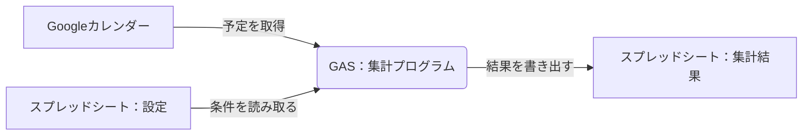

# 基本設計：Googleカレンダー作業実績集計ツール

このドキュメントでは、ツールの具体的な仕組み（どうやって動くか）を説明します。

## 1. 全体イメージ

## 2. スプレッドシートの構成

2つのシートで構成します。

### (1) 「設定」シート
ユーザーが条件を入力するシートです。
*   **B2セル**: 集計開始日（例：2024/01/01）
*   **B3セル**: 集計終了日（例：2024/01/31）
*   **B4セル**: 対象カレンダー名（空欄の場合はメインのカレンダー）
*   **B5セル**: 集計キーワード（初期値：`[実績]`）

### (2) 「集計結果」シート
集計されたデータが書き出されるシートです。
*   **1行目**: 見出し（日付、開始、終了、内容、詳細、時間）
*   **2行目以降**: カレンダーから取得したデータ

## 3. プログラム（GAS）の構成

`code.js` に以下の機能を実装します。

### (1) メニュー表示機能 (`onOpen`)
*   スプレッドシートを開いた時に実行されます。
*   「実績集計」というメニューを追加し、その中に「集計を実行する」ボタンを作ります。

### (2) メイン処理 (`main`)
*   「集計を実行する」ボタンが押された時に動く、全体の司令塔です。
*   以下の手順で処理を進めます。
    1.  設定シートから日付などの条件を読み取る。
    2.  カレンダーから予定を取得する。
    3.  取得した予定を一つずつ確認し、キーワードが含まれているかチェックする。
    4.  集計結果シートにデータを書き出す。
    5.  完了のメッセージを表示する。

### (3) 便利機能（ヘルパー関数）
*   `getEvents`: カレンダーから予定を取得する専用の機能。
*   `writeToSheet`: スプレッドシートにきれいに書き出す専用の機能。
*   `calculateHours`: 開始時間と終了時間から、作業時間を「○.○時間」に変換する機能。

## 4. データの取り扱いルール
*   **キーワード**: タイトルのどこかに含まれていれば集計対象とします（例：`[実績] デザイン作業`）。
*   **時間計算**: 
    *   （終了時刻 - 開始時刻）をミリ秒で計算。
    *   時間に変換（ミリ秒 / 1000 / 60 / 60）。
    *   小数点第2位で四捨五入します。

## 5. 安全のための工夫
*   **日付のチェック**: 開始日が終了日より後の日付になっていないか確認します。
*   **カレンダーの存在チェック**: 入力された名前のカレンダーが見つからない場合、分かりやすくお知らせします。
